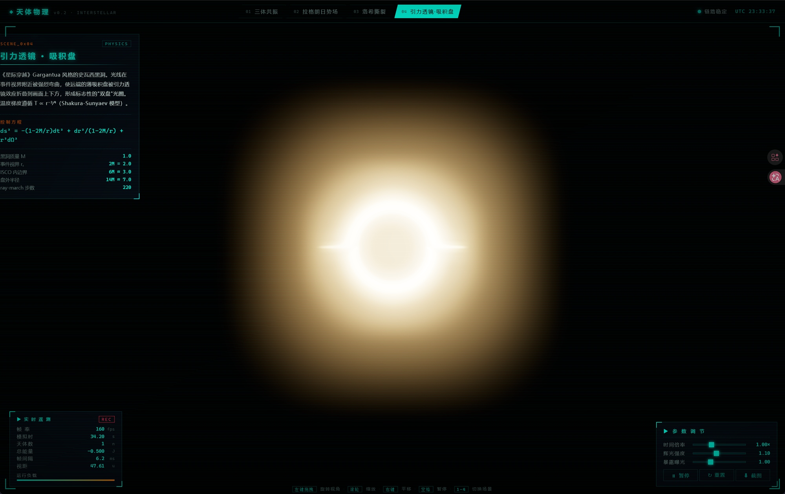

# Gargantua 3D · 交互式天体物理仿真

> 浏览器内运行的天体物理交互式可视化，灵感来自《星际穿越》。包含史瓦西黑洞引力透镜、三体共振、拉格朗日势场、洛希潮汐撕裂四个真实物理仿真场景。

<p align="center">
  
</p>

<p align="center">
  <a href="#-在线演示">在线演示</a> ·
  <a href="#-特性">特性</a> ·
  <a href="#-本地运行">本地运行</a> ·
  <a href="#-技术栈">技术栈</a> ·
  <a href="#-场景说明">场景说明</a> ·
  <a href="#-参与贡献">参与贡献</a>
</p>

<p align="center">
  
  
  
  
</p>

---

## ✨ 特性

- 🌌 **四个真实物理场景** — 三体共振、拉格朗日势场、洛希潮汐撕裂、Gargantua 风格黑洞
- 🌀 **GLSL Ray-Marching 黑洞** — fragment shader 内逐像素积分光线弯曲，再现《星际穿越》的"双盘"透镜效应
- 🎨 **Sci-Fi HUD** — 启动加载动画、罗盘、UTC 时钟、实时遥测、参数面板、CRT 扫描线
- 🎛️ **实时可调** — 时间倍率、辉光强度、曝光度、暂停/重置/截图
- ⚡ **轻量** — 单页应用，gzip 后约 140 KB（不含 three.js 内置）
- 🧮 **物理可信** — Velocity Verlet 积分、CR3BP 方程、Shakura-Sunyaev 温度剖面，非凭感觉的"假"动画
- 🌐 **全中文界面** — 含中文物理术语与控制方程

## 🚀 在线演示

> 暂未部署。可参考 [本地运行](#-本地运行) 自行启动。

部署到 GitHub Pages / Vercel / Netlify 的 PR 欢迎提交。

## 📦 本地运行

```bash
# 克隆
git clone https://github.com/s48401203a/gargantua-3d.git
cd gargantua-3d

# 安装（任选其一）
bun install     # 推荐，更快
# npm install
# pnpm install

# 启动开发服务器
bun run dev
# → http://127.0.0.1:5180/

# 生产构建
bun run build
```

要求：Node.js 18+ 或 Bun 1.0+。

## 🛠️ 技术栈

| 类别 | 技术 |
|------|------|
| 渲染 | [Three.js](https://threejs.org/) r169 |
| 后期 | EffectComposer + UnrealBloomPass + ACES Filmic |
| Shader | 自写 GLSL（黑洞 ray-marching） |
| 构建 | [Vite](https://vitejs.dev/) 5 + TypeScript 5 |
| 包管理 | [Bun](https://bun.sh/) 1.3（兼容 npm/pnpm） |
| UI | 原生 HTML/CSS + SVG（零运行时依赖） |

## 🪐 场景说明

### 01 三体共振

三个引力相互作用的质点，无解析解。采用 Chenciner-Montgomery（2000）"8 字形"周期解作为初始条件，加微小扰动暴露其混沌本质。

- **积分器**：Velocity Verlet（8 倍子步保证能量守恒）
- **方程**：𝐫̈ᵢ = G·Σⱼ mⱼ·(𝐫ⱼ - 𝐫ᵢ) / |𝐫ⱼ - 𝐫ᵢ|³
- **可见效果**：拖尾轨迹随时间发散，展现初始条件的敏感性

### 02 拉格朗日势场

圆形限制三体问题（CR3BP）在共转坐标系下的有效势能场，含 L1-L5 五个平衡点。

- **质量比 μ** = 0.012（类地月系统）
- **势能函数**：U(x,y) = -(1-μ)/r₁ - μ/r₂ - ½(x² + y²)
- **L1/L2/L3** 用牛顿迭代求解（鞍点，不稳定）
- **L4/L5** 解析位置（μ < 0.0385 时稳定，形成"蝌蚪轨道"）
- **可见效果**：测试粒子绕 L4/L5 做有界振荡

### 03 洛希潮汐撕裂

无内聚力小天体被强引力潮汐拉伸成"残骸流"，颜色编码距离。

- **粒子数**：900
- **洛希极限**：d = R · ∛(2 · ρ主/ρ子)
- **颜色**：青色（远）→ 橙色（进入洛希极限）→ 红色（接近表面）
- **可见效果**：粒子团进入极限内被沿径向拉成弧状

### 04 引力透镜 · 吸积盘

《星际穿越》Gargantua 风格史瓦西黑洞，GLSL 全屏 ray-marching 实现。

- **度规**：ds² = -(1-2M/r)dt² + dr²/(1-2M/r) + r²dΩ²
- **事件视界**：rₛ = 2M
- **ISCO**：6M（最内稳定圆轨道）
- **温度剖面**：T ∝ r⁻³⁄⁴（Shakura-Sunyaev）
- **湍流**：双层 FBM 噪声 + Kepler ω∝r⁻³⁄² 内快外慢
- **多普勒**：可控强度，默认 0.35（Nolan 在电影里关掉了，留少量保真）
- **可见效果**：远端盘被引力透镜折叠到画面上下方，形成 Gargantua 标志性"双盘"光圈

## ⌨️ 键位

| 操作 | 功能 |
|------|------|
| 左键拖拽 | 旋转视角 |
| 滚轮 | 缩放 |
| 右键拖拽 | 平移视角 |
| <kbd>空格</kbd> | 暂停 / 继续 |
| <kbd>1</kbd>–<kbd>4</kbd> | 切换场景 |

## 📁 项目结构

```
gargantua-3d/
├── index.html              # HUD DOM 骨架 + 启动加载层
├── package.json            # Three.js + Vite + TS
├── vite.config.ts          # 开发端口 5180
├── tsconfig.json           # strict mode
├── docs/                   # 截图
└── src/
    ├── main.ts             # 主循环 + Composer + OrbitControls + 参数面板
    ├── style.css           # Sci-Fi HUD 样式
    └── scenes/
        ├── Scene.ts        # 场景接口
        ├── ThreeBody.ts    # 三体（Verlet N-body）
        ├── Lagrange.ts     # 拉格朗日（CR3BP）
        ├── Roche.ts        # 洛希撕裂（粒子潮汐）
        └── Accretion.ts    # 黑洞（GLSL ray-marching）
```

## 🎯 已知局限

- **黑洞物理**：当前用牛顿引力近似（×1.25 修正系数）做光线弯曲，未实现完整 Schwarzschild 测地线积分。视觉接近，但对极端近视界区域不精确
- **黑洞自旋**：未实现 Kerr 黑洞的 frame-dragging
- **多普勒**：未实现相对论性 redshift（高速一侧应蓝移而非简单变亮）
- **性能**：黑洞场景在低端 GPU 上可能掉帧。可在 `src/scenes/Accretion.ts` 把 `STEPS = 220` 降到 `150`

欢迎 PR 改进这些。

## 🛣️ Roadmap

- [ ] Kerr 黑洞（自旋 + frame-dragging）
- [ ] 完整 Schwarzschild 测地线积分（Binet 方程）
- [ ] 相对论性多普勒红移
- [ ] 视频录制导出（MediaRecorder）
- [ ] 背景音乐 + FFT 频谱可视化
- [ ] 多语言切换（中/En）
- [ ] 移动端触控支持
- [ ] 数据导出（CSV 轨迹）

## 🤝 参与贡献

欢迎 Issue 与 PR。请先阅读 [CONTRIBUTING.md](CONTRIBUTING.md)。

适合新手的方向：
- 改进 CSS 样式 / 增加场景预设构型
- 增加新的初值条件（如其他 3 体周期解）
- 完善文档与物理原理注释
- 部署演示站

适合进阶的方向：
- 用 RK4/DOP853 替换 Verlet 提升精度
- 黑洞 shader 用真实 Binet 方程
- WebGPU 适配（GLSL → WGSL）

## 📜 协议

[Apache License 2.0](LICENSE) · Copyright (c) 2026

## 🙏 致谢

- 灵感来自 [@techartist_](https://x.com/techartist_) 在 X 上发布的 [interactive 3D astrophysics web app](https://x.com/techartist_/status/2053880178561200454) 演示
- 黑洞参考：[oseiskar/black-hole](https://github.com/oseiskar/black-hole) · [SushantGagneja/Black-Hole-simulation](https://github.com/SushantGagneja/Black-Hole-simulation)
- 三体参考：[ericye16/nbodies](https://github.com/ericye16/nbodies)
- 拉格朗日参考：[Samson-Mano/lagrange_points](https://github.com/Samson-Mano/lagrange_points)
- Chenciner-Montgomery 8 字形周期解：[Chenciner & Montgomery (2000)](https://arxiv.org/abs/math/0011268)
- 吸积盘温度剖面：Shakura & Sunyaev (1973)

---

<p align="center">
  Made with 🌌 by the community ·
  Built with <a href="https://threejs.org">Three.js</a>
</p>
